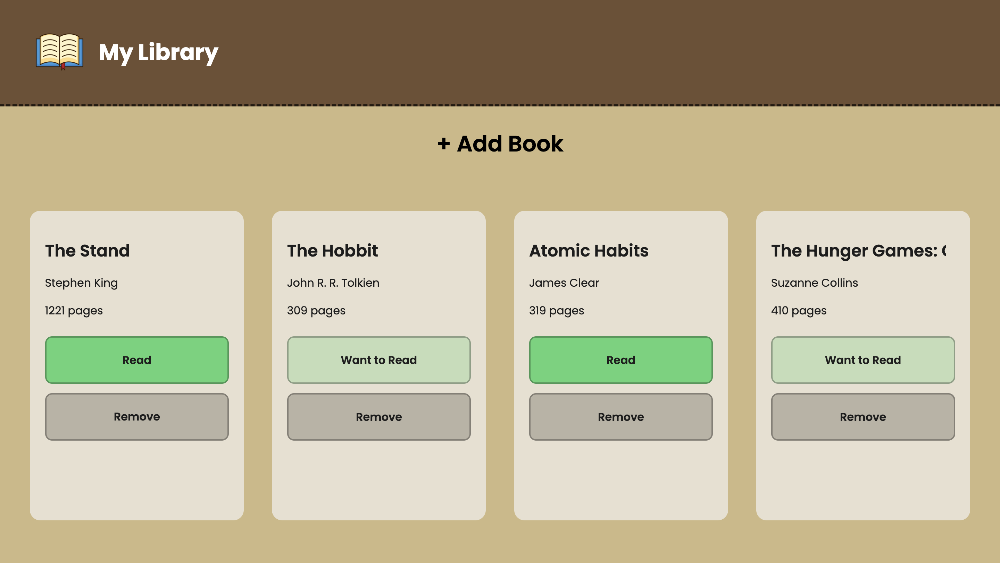
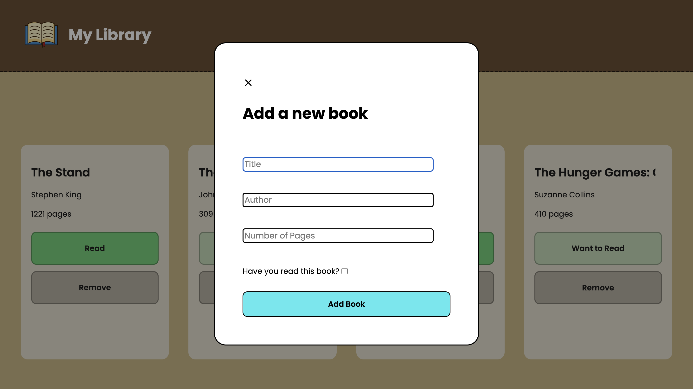

# JavaScript Library
This is a library page that allows you to track books you have read or want to read. I built this while taking The Odin Project's JavaScript course.
### Features
- Dynamically add and remove books
- Change the read status of books
- Automatically saves library data using `localStorage`
- Fully responsive design
### Technologies Used
- HTML5
- CSS3
- JavaScript (ES6+)

---

### Live Demo: https://jonny-berry.github.io/library-js/

---

### Connect with me
- [Email](jonnydevvs@gmail.com)
- [GitHub](https://github.com/JonnyFPS)
- [Twitter / X](https://x.com/jonnyDevvs)